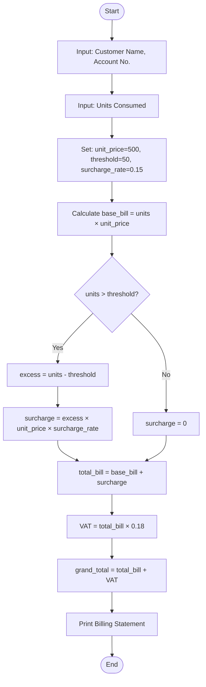
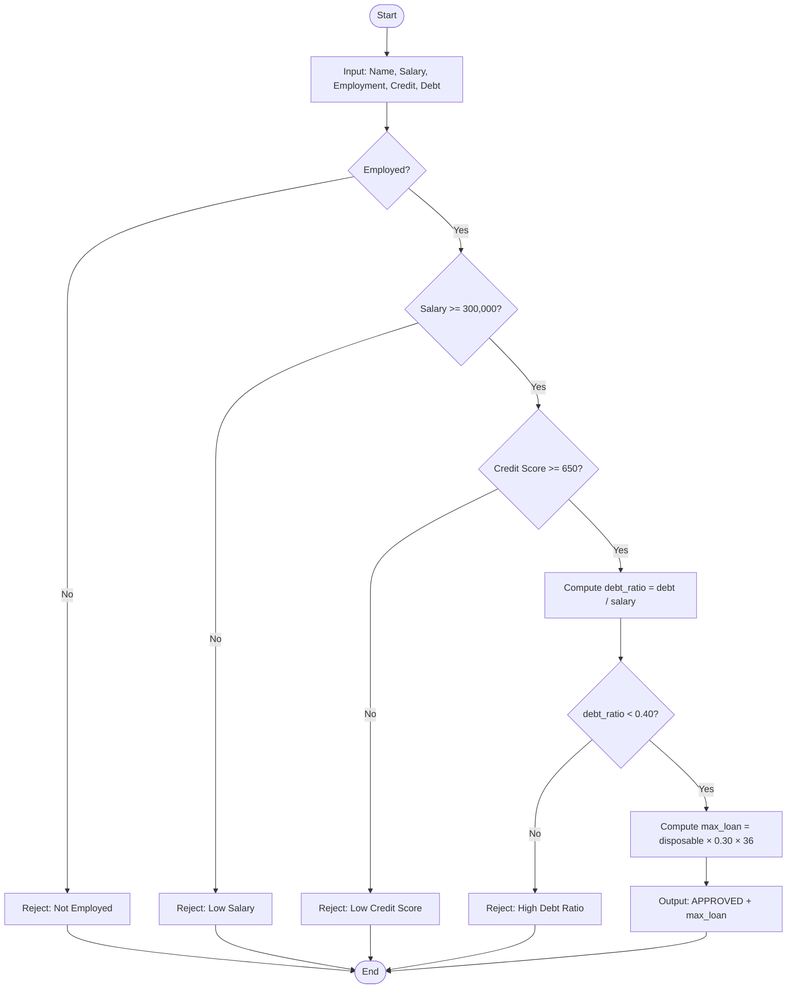

# Advanced System Analysis and Design of Algorithms


---

## Table of Contents

1. [Question 1 — Automated Water Billing System](#question-1-automated-water-billing-system)
2. [Question 2 — Bank Loan Eligibility System](#question-2-bank-loan-eligibility-system)
3. [Question 3 — Social Media Friend Recommendation System](#question-3-social-media-friend-recommendation-system)
4. [Question 4 — Search Algorithm Comparison](#question-4-search-algorithm-comparison--online-supermarket)
5. [Question 5 — Delivery Route Optimization](#question-5-delivery-route-optimization--east-africa-logistics)
6. [Question 6 — Intelligent Road Navigation System](#question-6-intelligent-road-navigation-system)
7. [Question 7 — Student Performance Analytics](#question-7-student-performance-analytics--sorting-algorithms)
8. [Question 8 — Hospital Patient Queue Management](#question-8-hospital-patient-queue-management-system)
9. [Question 9 — Student Records Hash Table](#question-9-student-records-hash-table--online-learning-platform)
10. [Question 10 — Product Recommendation Engine](#question-10-product-recommendation-engine--recursion-and-divide-and-conquer)

---

# Question 1: Automated Water Billing System

This question addresses automating a manual billing process for a national water utility. Customers are charged based on consumption units, with an environmental surcharge applied above a defined threshold.

---

## (a) Structured English Algorithm

The following step-by-step algorithm describes the complete billing process:

```
START

  Step 1:  Input customer name and account number
  Step 2:  Input number of water units consumed
  Step 3:  Set UNIT_PRICE = 500 (Rwf per unit)
  Step 4:  Set SURCHARGE_RATE = 0.15 (15%)
  Step 5:  Set THRESHOLD = 50 (units)

  Step 6:  Calculate base_bill = units_consumed × UNIT_PRICE

  Step 7:  IF units_consumed > THRESHOLD THEN
               excess_units = units_consumed - THRESHOLD
               surcharge = excess_units × UNIT_PRICE × SURCHARGE_RATE
           ELSE
               surcharge = 0
           END IF

  Step 8:  Calculate total_bill = base_bill + surcharge
  Step 9:  Calculate VAT = total_bill × 0.18
  Step 10: Calculate grand_total = total_bill + VAT

  Step 11: Print customer billing statement
  Step 12: Print account number, name, units consumed
  Step 13: Print base bill, surcharge, VAT, and grand total

END
```

---

## (b) Flowchart (Mermaid)

The flowchart below maps the complete billing process, including the surcharge decision branch. Paste the code into [mermaid.live](https://mermaid.live) to render.



---

## (c) Sample Calculations

Three customers with different consumption levels demonstrate the algorithm:

| Customer | Units | Base Bill (Rwf) | Surcharge (Rwf) | Grand Total (Rwf) |
|---|---|---|---|---|
| Alice (low) | 30 | 15,000 | 0 | 17,700 |
| Bob (at threshold) | 50 | 25,000 | 0 | 29,500 |
| Carol (excess) | 80 | 40,000 | 2,250 | 49,855 |

> **Carol's calculation detail:** excess = 80 − 50 = 30 units; surcharge = 30 × 500 × 0.15 = Rwf 2,250; total before VAT = 42,250; VAT (18%) = 7,605; grand total = **Rwf 49,855**.

---

## (d) Python Implementation

```python
# Water Billing System
# Calculates customer bills with optional conservation surcharge

UNIT_PRICE     = 500        # Cost per unit in Rwf
THRESHOLD      = 50         # Surcharge applies above this consumption
SURCHARGE_RATE = 0.15       # 15% on excess units
VAT_RATE       = 0.18       # 18% VAT


def calculate_bill(units: float) -> dict:
    """Return a breakdown dictionary for the given units consumed."""
    base_bill = units * UNIT_PRICE
    surcharge = 0.0
    if units > THRESHOLD:
        excess = units - THRESHOLD
        surcharge = excess * UNIT_PRICE * SURCHARGE_RATE
    total_before_vat = base_bill + surcharge
    vat = total_before_vat * VAT_RATE
    grand_total = total_before_vat + vat
    return {
        "base_bill":   base_bill,
        "surcharge":   surcharge,
        "vat":         vat,
        "grand_total": grand_total
    }


def print_bill(name: str, account: str, units: float) -> None:
    """Display a formatted billing statement for the customer."""
    bill = calculate_bill(units)
    print("=" * 50)
    print("   NATIONAL WATER UTILITY - BILLING STATEMENT")
    print("=" * 50)
    print(f"  Customer Name : {name}")
    print(f"  Account Number: {account}")
    print(f"  Units Consumed: {units}")
    print("-" * 50)
    print(f"  Base Bill     : Rwf {bill['base_bill']:>10,.0f}")
    print(f"  Surcharge     : Rwf {bill['surcharge']:>10,.0f}")
    print(f"  VAT (18%)     : Rwf {bill['vat']:>10,.0f}")
    print("-" * 50)
    print(f"  TOTAL DUE     : Rwf {bill['grand_total']:>10,.0f}")
    print("=" * 50)


# --- Test Cases ---
print_bill("Alice Uwimana", "ACC-001", 30)
print_bill("Bob Kagabo",    "ACC-002", 50)
print_bill("Carol Mutoni",  "ACC-003", 80)
```

### Expected Output

```
==================================================
   NATIONAL WATER UTILITY - BILLING STATEMENT
==================================================
  Customer Name : Alice Uwimana
  Account Number: ACC-001
  Units Consumed: 30
--------------------------------------------------
  Base Bill     : Rwf     15,000
  Surcharge     : Rwf          0
  VAT (18%)     : Rwf      2,700
--------------------------------------------------
  TOTAL DUE     : Rwf     17,700
==================================================
```

---

# Question 2: Bank Loan Eligibility System

This question develops an automated loan eligibility assessment system that evaluates applicants based on four criteria: salary, employment status, credit score, and existing debt levels.

---

## (a) Role of Algorithms in Banking Information Systems

Algorithms are the decision-making backbone of modern banking information systems. Rather than relying on subjective human judgment, algorithms apply consistent, auditable rules that process applicant data and return objective outcomes. In a loan system, an algorithm:

- **Ensures consistency** — every applicant is evaluated against identical criteria
- **Increases speed** — thousands of applications can be processed in seconds
- **Reduces bias** — decisions are based on data, not personal relationships
- **Supports compliance** — automated audit trails satisfy regulatory requirements
- **Scales effortlessly** — the same logic handles ten or ten million applications

Financial institutions also use algorithms for fraud detection, credit scoring, risk modelling, and real-time transaction monitoring. The reliability and correctness of these algorithms directly affects both profitability and customer trust.

---

## (b) Pseudocode Algorithm

```
BEGIN LoanEligibility

  INPUT applicant_name
  INPUT monthly_salary
  INPUT employment_status    // 'employed' or 'unemployed'
  INPUT credit_score         // 0 - 850
  INPUT existing_debt        // total monthly debt obligations

  SET MIN_SALARY     = 300000   // Rwf per month
  SET MIN_CREDIT     = 650
  SET MAX_DEBT_RATIO = 0.40     // debt must be < 40% of salary

  IF employment_status != 'employed' THEN
      OUTPUT 'REJECTED: Applicant must be employed'
      STOP
  END IF

  IF monthly_salary < MIN_SALARY THEN
      OUTPUT 'REJECTED: Salary below minimum threshold'
      STOP
  END IF

  IF credit_score < MIN_CREDIT THEN
      OUTPUT 'REJECTED: Credit score too low'
      STOP
  END IF

  SET debt_ratio = existing_debt / monthly_salary

  IF debt_ratio >= MAX_DEBT_RATIO THEN
      OUTPUT 'REJECTED: Debt-to-income ratio too high'
      STOP
  END IF

  // All checks passed — calculate maximum loan
  SET disposable          = monthly_salary - existing_debt
  SET max_monthly_payment = disposable * 0.30
  SET max_loan            = max_monthly_payment * 36   // 3-year term

  OUTPUT 'APPROVED'
  OUTPUT 'Maximum Loan Amount: ' + max_loan

END LoanEligibility
```

---

## (c) Flowchart (Mermaid)



---

## (d) Python Implementation

```python
# Automated Loan Eligibility Assessment System

MIN_SALARY       = 300_000  # Rwf per month
MIN_CREDIT       = 650
MAX_DEBT_RATIO   = 0.40
LOAN_TERM_MONTHS = 36


def assess_loan(name, salary, employed, credit_score, debt):
    """Evaluate loan eligibility and return a result message."""
    print(f"\n{'=' * 52}")
    print(f"  LOAN APPLICATION: {name}")
    print(f"{'=' * 52}")

    if not employed:
        return "REJECTED: Applicant must be employed."
    if salary < MIN_SALARY:
        return f"REJECTED: Salary Rwf {salary:,} is below minimum Rwf {MIN_SALARY:,}."
    if credit_score < MIN_CREDIT:
        return f"REJECTED: Credit score {credit_score} is below minimum {MIN_CREDIT}."

    debt_ratio = debt / salary
    if debt_ratio >= MAX_DEBT_RATIO:
        return f"REJECTED: Debt ratio {debt_ratio:.0%} exceeds 40% limit."

    disposable  = salary - debt
    max_payment = disposable * 0.30
    max_loan    = max_payment * LOAN_TERM_MONTHS
    return (f"APPROVED\n  Maximum Loan    : Rwf {max_loan:>12,.0f}\n"
            f"  Monthly Payment : Rwf {max_payment:>12,.0f}")


# --- Test Cases ---
cases = [
    ("Grace Ingabire",  450_000, True,  720, 60_000),   # APPROVE
    ("Paul Mutabazi",   200_000, True,  700, 30_000),   # Reject: low salary
    ("Jean Nsabimana",  500_000, False, 700, 50_000),   # Reject: unemployed
    ("Diane Uwase",     400_000, True,  580, 40_000),   # Reject: low credit
]

for case in cases:
    result = assess_loan(*case)
    print(f"  Result: {result}")
```

---

# Question 3: Social Media Friend Recommendation System

This question applies graph theory and set operations to model social network friendships and derive meaningful recommendations.

---

## (a) Adjacency List Graph Implementation

In graph theory, a social network is naturally modelled as an undirected graph where users are vertices and friendships are edges. An adjacency list stores each user alongside a list of their direct friends, making it both memory-efficient and fast for traversal operations.

```python
# Social Network Graph using Adjacency List

class SocialGraph:
    """Undirected graph representing social network friendships."""

    def __init__(self):
        self.graph = {}

    def add_user(self, user):
        if user not in self.graph:
            self.graph[user] = []

    def add_friendship(self, user1, user2):
        self.add_user(user1)
        self.add_user(user2)
        if user2 not in self.graph[user1]:
            self.graph[user1].append(user2)
        if user1 not in self.graph[user2]:
            self.graph[user2].append(user1)

    def get_friends(self, user):
        return self.graph.get(user, [])

    def display(self):
        print("\n--- Social Graph (Adjacency List) ---")
        for user, friends in self.graph.items():
            print(f"  {user:10s} --> {friends}")


# Build sample network
net = SocialGraph()
net.add_friendship("Alice", "Bob")
net.add_friendship("Alice", "Carol")
net.add_friendship("Bob",   "Dave")
net.add_friendship("Carol", "Dave")
net.add_friendship("Dave",  "Eve")
net.add_friendship("Alice", "Eve")
net.display()
```

---

## (b) BFS Traversal for User Connections

Breadth-First Search (BFS) explores a graph layer by layer, starting from the source user and visiting all direct friends before moving to friends-of-friends. This mirrors how a recommendation system identifies degree-1 and degree-2 connections.

```python
from collections import deque

def bfs(graph_obj, start):
    """Traverse network using BFS and display connection order."""
    visited = set()
    queue   = deque([(start, 0)])  # (user, depth)
    visited.add(start)
    print(f"\nBFS traversal from '{start}':")

    while queue:
        user, depth = queue.popleft()
        print(f"  Depth {depth}: {user}")
        for friend in graph_obj.get_friends(user):
            if friend not in visited:
                visited.add(friend)
                queue.append((friend, depth + 1))


bfs(net, "Alice")

# Expected Output:
# Depth 0: Alice
# Depth 1: Bob
# Depth 1: Carol
# Depth 1: Eve
# Depth 2: Dave
```

---

## (c) Set Operations on Friendship Data

Set operations make it straightforward to find mutual friends, people in at least one of two friend circles, or friends exclusive to one user.

```python
# Friendship sets for set operations
alice_friends = {"Bob", "Carol", "Eve", "Dave"}
bob_friends   = {"Alice", "Dave", "Frank", "Grace"}
carol_friends = {"Alice", "Dave", "Henry"}

print('--- Set Operations ---')
print(f'Alice friends : {alice_friends}')
print(f'Bob friends   : {bob_friends}')

union        = alice_friends | bob_friends
intersection = alice_friends & bob_friends
difference   = alice_friends - bob_friends
sym_diff     = alice_friends ^ bob_friends

print(f'\nUnion (all connections)       : {union}')
print(f'Intersection (mutual friends) : {intersection}')
print(f'Difference (Alice only)       : {difference}')
print(f'Symmetric Difference          : {sym_diff}')

# Mutual friends between Alice and Carol
mutual_ac = alice_friends & carol_friends
print(f'\nAlice & Carol mutual friends  : {mutual_ac}')
```

---

## (d) How Graph Algorithms Improve Recommendations

Social media platforms translate friendship data into valuable suggestions using graph algorithms in several ways:

- **Mutual friends (set intersection):** If Alice and Carol share three mutual friends but are not yet connected, the platform flags Carol as a strong recommendation for Alice.
- **BFS degree expansion:** BFS identifies degree-2 connections — friends of friends — who share many edges with you but are not yet direct friends. These are the highest-quality recommendations.
- **Community detection:** Algorithms such as Louvain clustering identify dense sub-graphs (communities). Users within the same community who are not yet connected are likely to have shared interests.
- **Graph centrality:** Highly connected users (high degree centrality) are surfaced as suggested follows, since connecting with them exposes you to a wider community.

In practice, platforms such as LinkedIn (*People You May Know*) and Facebook (*Friend Suggestions*) use combinations of BFS, Jaccard similarity on adjacency sets, and machine learning trained on graph features to rank recommendations by relevance.

---

# Question 4: Search Algorithm Comparison — Online Supermarket

This question compares Linear Search and Binary Search in terms of correctness, time complexity, and empirical performance under increasing dataset sizes.

---

## (a) Python Implementations

```python
# Linear Search — examines each element in turn
def linear_search(arr, target):
    """Return index of target or -1 if not found."""
    for i, item in enumerate(arr):
        if item == target:
            return i
    return -1


# Binary Search — requires sorted array; halves search space each step
def binary_search(arr, target):
    """Return index of target in sorted arr, or -1 if not found."""
    low, high = 0, len(arr) - 1
    while low <= high:
        mid = (low + high) // 2
        if arr[mid] == target:
            return mid
        elif arr[mid] < target:
            low = mid + 1
        else:
            high = mid - 1
    return -1


# --- Correctness Tests ---
products = sorted([f'product_{i:04d}' for i in range(1, 1001)])
target   = 'product_0750'

li = linear_search(products, target)
bi = binary_search(products, target)
print(f'Linear Search  found "{target}" at index {li}')
print(f'Binary Search  found "{target}" at index {bi}')

missing = 'product_9999'
print(f'Linear Search  for missing item: {linear_search(products, missing)}')
print(f'Binary Search  for missing item: {binary_search(products, missing)}')
```

---

## (b) Time Complexity Analysis

| Case | Linear Search | Binary Search |
|---|---|---|
| Best Case | O(1) — first element matches | O(1) — middle element matches |
| Average Case | O(n) — scan half the list | O(log n) — halve search space |
| Worst Case | O(n) — last or not found | O(log n) — last split |
| Space | O(1) — no extra memory | O(1) — iterative version |
| Pre-condition | None — works on unsorted data | Array must be sorted first |

> For a product database of one million items, Binary Search requires at most **20 comparisons** (log₂ 1,000,000 ≈ 20), while Linear Search may inspect all one million records.

---

## (c) Execution Time Measurement

```python
import time, random

def benchmark(sizes):
    print(f'\n{"Size":>10}  {"Linear (ms)":>14}  {"Binary (ms)":>14}')
    print('-' * 44)
    for n in sizes:
        data   = sorted(random.sample(range(n * 10), n))
        target = random.choice(data)

        t0 = time.perf_counter()
        for _ in range(500): linear_search(data, target)
        linear_ms = (time.perf_counter() - t0) / 500 * 1000

        t0 = time.perf_counter()
        for _ in range(500): binary_search(data, target)
        binary_ms = (time.perf_counter() - t0) / 500 * 1000

        print(f'{n:>10,}  {linear_ms:>14.4f}  {binary_ms:>14.4f}')


benchmark([1_000, 5_000, 10_000, 50_000, 100_000])
```

---

## (d) Matplotlib Performance Plot

```python
import matplotlib.pyplot as plt
import time, random

sizes = [1_000, 5_000, 10_000, 50_000, 100_000, 500_000]
linear_times, binary_times = [], []

for n in sizes:
    data   = sorted(random.sample(range(n * 10), n))
    target = data[n // 2]

    t0 = time.perf_counter()
    for _ in range(200): linear_search(data, target)
    linear_times.append((time.perf_counter() - t0) / 200 * 1000)

    t0 = time.perf_counter()
    for _ in range(200): binary_search(data, target)
    binary_times.append((time.perf_counter() - t0) / 200 * 1000)

plt.figure(figsize=(9, 5))
plt.plot(sizes, linear_times, 'o-', color='crimson',   label='Linear Search O(n)')
plt.plot(sizes, binary_times, 's-', color='steelblue', label='Binary Search O(log n)')
plt.xlabel('Dataset Size (number of products)')
plt.ylabel('Average Execution Time (ms)')
plt.title('Linear vs Binary Search — Performance Comparison')
plt.legend()
plt.tight_layout()
plt.savefig('search_comparison.png', dpi=150)
plt.show()

# INTERPRETATION:
# Linear Search time grows linearly with n — doubling the dataset roughly
# doubles the search time. Binary Search remains nearly flat because each
# comparison halves the remaining space. For large product databases,
# Binary Search is drastically more efficient.
```

---

# Question 5: Delivery Route Optimization — East Africa Logistics

This question evaluates three algorithmic paradigms — Greedy, Dynamic Programming, and Backtracking — for optimizing delivery routes across East African cities.

---

## (a) Greedy Algorithm — Nearest Neighbour

A greedy algorithm makes the locally optimal choice at each step. Here, the courier always travels to the unvisited destination closest to the current location.

```python
# Greedy Nearest-Neighbour Delivery Route
import math

# Delivery locations with (latitude, longitude) approximations
locations = {
    'Kigali':        (-1.94, 30.06),
    'Kampala':       ( 0.32, 32.58),
    'Nairobi':       (-1.29, 36.82),
    'Dar es Salaam': (-6.80, 39.27),
    'Mombasa':       (-4.05, 39.67),
}

def distance(c1, c2):
    return math.sqrt((c1[0] - c2[0])**2 + (c1[1] - c2[1])**2)

def greedy_route(start):
    """Build route by always visiting nearest unvisited city."""
    unvisited  = set(locations.keys()) - {start}
    route      = [start]
    current    = start
    total_dist = 0.0

    while unvisited:
        nearest = min(unvisited, key=lambda c: distance(locations[current], locations[c]))
        total_dist += distance(locations[current], locations[nearest])
        route.append(nearest)
        current = nearest
        unvisited.remove(nearest)

    total_dist += distance(locations[current], locations[start])  # return home
    route.append(start)
    return route, total_dist


route, dist = greedy_route('Kigali')
print('Greedy Route:', ' -> '.join(route))
print(f'Total Distance (degree units): {dist:.3f}')
```

---

## (b) Dynamic Programming — Minimum Cost Path

Dynamic Programming solves the optimal sub-problem once and caches the result, avoiding redundant recomputation. Below we find the minimum cost path between two cities using Floyd-Warshall all-pairs shortest path.

```python
# DP: Minimum Transportation Cost (Floyd-Warshall)
INF    = float('inf')
CITIES = ['Kigali', 'Kampala', 'Nairobi', 'Dar es Salaam', 'Mombasa']

C = [  # cost in USD (INF = no direct link)
    [0,   150, 250, 300, INF],
    [150,   0, 200, INF, INF],
    [250, 200,   0, 180, 100],
    [300, INF, 180,   0,  80],
    [INF, INF, 100,  80,   0],
]
n = len(CITIES)

def floyd_warshall():
    """All-pairs shortest cost using Floyd-Warshall DP."""
    dist      = [row[:] for row in C]
    next_city = [[j if C[i][j] < INF else None for j in range(n)] for i in range(n)]

    for k in range(n):
        for i in range(n):
            for j in range(n):
                if dist[i][k] + dist[k][j] < dist[i][j]:
                    dist[i][j]      = dist[i][k] + dist[k][j]
                    next_city[i][j] = next_city[i][k]
    return dist, next_city

def get_path(next_city, src, dst):
    if next_city[src][dst] is None:
        return []
    path = [src]
    while src != dst:
        src = next_city[src][dst]
        path.append(src)
    return path


dist, nxt   = floyd_warshall()
src, dst    = 0, 4  # Kigali -> Mombasa
path_idx    = get_path(nxt, src, dst)
path_names  = [CITIES[i] for i in path_idx]

print(f'Cheapest route: {" -> ".join(path_names)}')
print(f'Minimum cost  : USD {dist[src][dst]}')
```

---

## (c) Backtracking — All Valid Routes

Backtracking explores all possible paths, pruning those that violate constraints (e.g., exceeding a maximum cost budget).

```python
# Backtracking: find all delivery routes within a cost budget
MAX_COST = 500  # USD budget constraint

def backtrack_routes(current, visited, path, cost, all_routes):
    if len(visited) == n:
        all_routes.append((path[:], cost))
        return

    for nxt_city in range(n):
        if nxt_city not in visited and C[current][nxt_city] < INF:
            new_cost = cost + C[current][nxt_city]
            if new_cost <= MAX_COST:
                visited.add(nxt_city)
                path.append(nxt_city)
                backtrack_routes(nxt_city, visited, path, new_cost, all_routes)
                path.pop()
                visited.remove(nxt_city)


all_routes = []
backtrack_routes(0, {0}, [0], 0, all_routes)

print(f'\nValid routes from Kigali within USD {MAX_COST}:')
for route, cost in all_routes[:5]:
    names = ' -> '.join(CITIES[i] for i in route)
    print(f'  {names}  | Cost: USD {cost}')
print(f'Total valid routes found: {len(all_routes)}')
```

---

## (d) Algorithm Comparison

| Criterion | Greedy | Dynamic Programming | Backtracking |
|---|---|---|---|
| Time Complexity | O(n²) | O(n³) Floyd-Warshall | O(n!) worst case |
| Space Complexity | O(n) | O(n²) | O(n) call stack |
| Solution Quality | Approximate — often suboptimal | Optimal | Optimal (all valid paths) |
| Speed (large n) | Very fast | Moderate | Extremely slow |
| Best Use Case | Quick estimates, real-time dispatch | Pre-computed optimal paths | Small networks, constraint checking |

> **Conclusion:** For a logistics company, a hybrid approach is recommended — use DP to pre-compute optimal inter-city costs, and Greedy nearest-neighbour for real-time driver dispatch where speed outweighs perfect optimality.

---

# Question 6: Intelligent Road Navigation System

This question builds a weighted road network graph and applies Dijkstra's shortest path, BFS/DFS traversal, and Prim's Minimum Spanning Tree algorithms.

---

## (a) Weighted Graph using Adjacency List

```python
# Weighted Road Navigation Graph
from heapq import heappush, heappop
from collections import deque

# Graph: adjacency list {city: [(neighbour, distance_km), ...]}
road_graph = {
    'Kigali':  [('Musanze', 110), ('Huye', 130), ('Kayonza', 75)],
    'Musanze': [('Kigali', 110), ('Rubavu', 60)],
    'Rubavu':  [('Musanze', 60), ('Rusizi', 220)],
    'Huye':    [('Kigali', 130), ('Rusizi', 90)],
    'Rusizi':  [('Huye', 90), ('Rubavu', 220)],
    'Kayonza': [('Kigali', 75), ('Kirehe', 85)],
    'Kirehe':  [('Kayonza', 85)],
}

def display_graph(g):
    print("\n--- Road Network (Adjacency List) ---")
    for city, roads in g.items():
        links = ", ".join(f"{n}({d}km)" for n, d in roads)
        print(f"  {city:12s} --> {links}")

display_graph(road_graph)
```

---

## (b) Dijkstra's Shortest Path

```python
def dijkstra(graph, start, end):
    """Return shortest distance and path from start to end."""
    dist = {city: float('inf') for city in graph}
    dist[start] = 0
    prev = {city: None for city in graph}
    pq   = [(0, start)]

    while pq:
        d, u = heappop(pq)
        if d > dist[u]:
            continue
        for v, w in graph[u]:
            if dist[u] + w < dist[v]:
                dist[v] = dist[u] + w
                prev[v] = u
                heappush(pq, (dist[v], v))

    # Reconstruct path
    path, node = [], end
    while node:
        path.append(node)
        node = prev[node]
    return dist[end], list(reversed(path))


d, path = dijkstra(road_graph, 'Kigali', 'Rusizi')
print(f'\nShortest path Kigali -> Rusizi: {" -> ".join(path)}')
print(f'Distance: {d} km')
```

---

## (c) BFS and DFS Traversal

```python
def bfs_traverse(graph, start):
    """Breadth-first traversal of road network."""
    visited, queue, order = set(), deque([start]), []
    visited.add(start)
    while queue:
        city = queue.popleft()
        order.append(city)
        for neighbour, _ in graph[city]:
            if neighbour not in visited:
                visited.add(neighbour)
                queue.append(neighbour)
    return order


def dfs_traverse(graph, start, visited=None, order=None):
    """Depth-first traversal of road network."""
    if visited is None:
        visited, order = set(), []
    visited.add(start)
    order.append(start)
    for neighbour, _ in graph[start]:
        if neighbour not in visited:
            dfs_traverse(graph, neighbour, visited, order)
    return order


print('BFS:', ' -> '.join(bfs_traverse(road_graph, 'Kigali')))
print('DFS:', ' -> '.join(dfs_traverse(road_graph, 'Kigali')))
```

---

## (d) Prim's Minimum Spanning Tree

A Minimum Spanning Tree (MST) connects all cities with the minimum total road length, avoiding cycles. In infrastructure planning, the MST reveals which roads must exist to keep the network connected at minimum construction cost.

```python
import heapq

def prims_mst(graph):
    """Find Minimum Spanning Tree using Prim's algorithm."""
    start   = next(iter(graph))
    visited = {start}
    edges   = [(w, start, v) for v, w in graph[start]]
    mst, total = [], 0
    heapq.heapify(edges)

    while edges and len(visited) < len(graph):
        w, u, v = heapq.heappop(edges)
        if v in visited:
            continue
        visited.add(v)
        mst.append((u, v, w))
        total += w
        for neighbour, cost in graph[v]:
            if neighbour not in visited:
                heapq.heappush(edges, (cost, v, neighbour))

    return mst, total


mst_edges, mst_cost = prims_mst(road_graph)
print("\nPrim's MST:")
for u, v, w in mst_edges:
    print(f'  {u:12s} <-> {v:12s}  {w} km')
print(f'Total MST distance: {mst_cost} km')

# Infrastructure planning insight:
# The MST tells planners the minimum road network to keep all cities connected.
# Removing any MST edge disconnects the network.
# Edges beyond the MST provide route redundancy.
```

---

# Question 7: Student Performance Analytics — Sorting Algorithms

This question implements and compares Bubble Sort and Merge Sort for ordering student examination scores in a university analytics system.

---

## (a) Bubble Sort and Merge Sort

```python
# Bubble Sort: repeatedly swap adjacent elements if out of order
def bubble_sort(arr):
    a = arr[:]
    n = len(a)
    for i in range(n):
        swapped = False
        for j in range(0, n - i - 1):
            if a[j] > a[j + 1]:
                a[j], a[j + 1] = a[j + 1], a[j]
                swapped = True
        if not swapped:   # already sorted — early exit
            break
    return a


# Merge Sort: divide-and-conquer — split, sort halves, merge
def merge_sort(arr):
    if len(arr) <= 1:
        return arr
    mid   = len(arr) // 2
    left  = merge_sort(arr[:mid])
    right = merge_sort(arr[mid:])
    return merge(left, right)

def merge(left, right):
    result, i, j = [], 0, 0
    while i < len(left) and j < len(right):
        if left[i] <= right[j]:
            result.append(left[i]); i += 1
        else:
            result.append(right[j]); j += 1
    result.extend(left[i:])
    result.extend(right[j:])
    return result


# --- Test ---
scores = [78, 45, 92, 61, 33, 88, 71, 55, 99, 40]
print('Original:', scores)
print('Bubble  :', bubble_sort(scores))
print('Merge   :', merge_sort(scores))
```

---

## (b) Time Complexity Comparison

| Property | Bubble Sort | Merge Sort |
|---|---|---|
| Best Case | O(n) — with early-exit flag | O(n log n) |
| Average Case | O(n²) | O(n log n) |
| Worst Case | O(n²) | O(n log n) |
| Space | O(1) — in-place | O(n) — merge buffers |
| Stability | Stable | Stable |
| Adaptive | Yes (with flag) | No |

---

## (c) Execution Time Benchmark

```python
import time, random
import matplotlib.pyplot as plt

sizes = [100, 500, 1_000, 3_000, 5_000]
bubble_times, merge_times = [], []

for n in sizes:
    data = [random.randint(0, 10_000) for _ in range(n)]

    t0 = time.perf_counter()
    bubble_sort(data)
    bubble_times.append(time.perf_counter() - t0)

    t0 = time.perf_counter()
    merge_sort(data)
    merge_times.append(time.perf_counter() - t0)

plt.figure(figsize=(9, 5))
plt.plot(sizes, bubble_times, 'o-', color='tomato',    label='Bubble Sort O(n²)')
plt.plot(sizes, merge_times,  's-', color='royalblue', label='Merge Sort O(n log n)')
plt.xlabel('Number of Student Records')
plt.ylabel('Execution Time (seconds)')
plt.title('Bubble Sort vs Merge Sort — Performance')
plt.legend()
plt.tight_layout()
plt.savefig('sorting_benchmark.png', dpi=150)
plt.show()
```

---

## (d) Recommendation for Large Educational Datasets

Merge Sort is strongly recommended for large educational datasets:

- **Bubble Sort** degrades to O(n²) for random or reverse-sorted data. With 100,000 student records, this translates to roughly 10 billion comparisons — unacceptable in a production system.
- **Merge Sort** guarantees O(n log n) in all cases. Even in the worst case, 100,000 records require only about 1.7 million comparisons.
- Merge Sort is **stable**, preserving the relative order of students with equal scores — important when secondary sort criteria (e.g., student ID) must be respected.
- The O(n) extra space is entirely acceptable given the performance gain; modern servers have ample RAM.

For very large datasets stored externally, an **External Merge Sort** variant that merges sorted file chunks would be the enterprise-level solution.

---

# Question 8: Hospital Patient Queue Management System

This question designs a patient queue system with priority-based triage for an emergency department, where critical patients must be attended before lower-priority cases regardless of arrival order.

---

## (a) Role of Queue Data Structures in Healthcare

A queue is a First-In, First-Out (FIFO) data structure that models any waiting-line scenario. In healthcare:

- **Standard queues** manage patient registration and general appointment scheduling by preserving arrival order.
- **Priority queues** override strict FIFO when medical urgency demands it — a cardiac arrest patient must bypass routine consultations.
- **Queues support multi-department routing:** a patient dequeued from triage is enqueued into radiology, pharmacy, or a ward queue.
- They provide measurable **throughput metrics** (average wait time, queue length) that hospital administrators use to allocate staff.

Without queue data structures, emergency departments would rely on manual lists prone to human error, delays, and missed critical cases.

---

## (b) Queue Using Python Lists

```python
# Basic FIFO Queue using Python deque
from collections import deque

class PatientQueue:
    """Simple FIFO queue for general patient management."""

    def __init__(self):
        self._queue = deque()

    def enqueue(self, patient):
        self._queue.append(patient)
        print(f"  Registered: {patient}")

    def dequeue(self):
        if self.is_empty():
            print("  No patients in queue.")
            return None
        patient = self._queue.popleft()
        print(f"  Called to consultation: {patient}")
        return patient

    def is_empty(self): return len(self._queue) == 0
    def size(self):     return len(self._queue)
    def peek(self):     return self._queue[0] if self._queue else None


# Demo
q = PatientQueue()
q.enqueue("Alice — General Checkup")
q.enqueue("Bob   — Routine Vaccination")
q.enqueue("Carol — Blood Test")
print(f'  Queue size: {q.size()}')
q.dequeue()
q.dequeue()
```

---

## (c) Priority Queue for Emergency Patients

Emergency triage assigns each patient a numeric priority: **1 = Critical, 2 = Urgent, 3 = Semi-urgent, 4 = Non-urgent**. Python's `heapq` module provides an efficient min-heap that always pops the smallest (highest-priority) value.

```python
import heapq

class EmergencyQueue:
    """Priority queue where lower priority number = higher urgency."""

    PRIORITY_LABELS = {1: 'CRITICAL', 2: 'URGENT', 3: 'SEMI-URGENT', 4: 'NON-URGENT'}

    def __init__(self):
        self._heap    = []
        self._counter = 0  # tie-break by arrival order

    def admit(self, name, priority):
        heapq.heappush(self._heap, (priority, self._counter, name))
        self._counter += 1
        label = self.PRIORITY_LABELS.get(priority, '?')
        print(f"  Admitted: {name:20s} [{label}]")

    def treat_next(self):
        if not self._heap:
            print("  No patients waiting.")
            return
        priority, _, name = heapq.heappop(self._heap)
        label = self.PRIORITY_LABELS.get(priority, '?')
        print(f"  TREATING : {name:20s} [{label}]")

    def show_queue(self):
        print(f"\n  Waiting ({len(self._heap)} patients):")
        for pri, _, name in sorted(self._heap):
            print(f'    Priority {pri} | {self.PRIORITY_LABELS[pri]:12s} | {name}')


# Simulation
eq = EmergencyQueue()
print('--- ADMISSIONS ---')
eq.admit('John Doe',       3)   # semi-urgent
eq.admit('Jane Smith',     1)   # critical
eq.admit('Peter Mukiza',   2)   # urgent
eq.admit('Mary Uwera',     4)   # non-urgent
eq.admit('David Habimana', 1)   # critical
eq.show_queue()

print('\n--- TREATMENT ORDER ---')
for _ in range(5):
    eq.treat_next()
```

---

## (d) Efficiency Analysis of Queue Operations

| Operation | Standard Queue (deque) | Priority Queue (heapq) | Notes |
|---|---|---|---|
| Enqueue / Admit | O(1) | O(log n) | Heap maintains order on insert |
| Dequeue / Treat | O(1) | O(log n) | Heap rebalances on pop |
| Peek (next patient) | O(1) | O(1) | heapq[0] is always minimum |
| Search by name | O(n) | O(n) | Linear scan required |
| Space Complexity | O(n) | O(n) | Stores all waiting patients |

> For emergency departments, the O(log n) overhead of the priority queue is negligible — even with 1,000 waiting patients, only ~10 comparisons are needed per operation. This is a worthwhile trade-off for ensuring critical patients are always treated first.

---

# Question 9: Student Records Hash Table — Online Learning Platform

This question explores hashing as an efficient data storage and retrieval mechanism for a platform managing thousands of student enrolment records.

---

## (a) Hashing and Hash Tables Explained

**Hashing** is the process of converting a key (such as a student ID) into a fixed-size integer — the *hash* — which acts as an array index for direct storage and retrieval. A **hash table** (also called a hash map or dictionary) is the data structure that uses this mechanism.

The core advantage is speed: instead of scanning all records to find one student, the system computes a hash and jumps directly to the correct location — an average **O(1) lookup** regardless of how many records exist.

A hash function must be deterministic (same input always produces same output), fast to compute, and distribute keys uniformly to avoid clustering. Python dictionaries are implemented internally as highly optimised hash tables.

---

## (b) Hash Table Implementation

```python
# Student Records Hash Table using Python Dictionary

class StudentHashTable:
    """Hash table for managing student records on the learning platform."""

    def __init__(self):
        self._table = {}

    # O(1) average — INSERT
    def insert(self, student_id, name, course, gpa):
        if student_id in self._table:
            print(f"  Warning: {student_id} already exists. Use update().")
            return
        self._table[student_id] = {'name': name, 'course': course, 'gpa': gpa}
        print(f"  Inserted: [{student_id}] {name}")

    # O(1) average — SEARCH
    def search(self, student_id):
        record = self._table.get(student_id)
        if record:
            print(f"  Found   : [{student_id}] {record}")
        else:
            print(f"  Not Found: {student_id}")
        return record

    # O(1) average — UPDATE
    def update(self, student_id, **kwargs):
        if student_id not in self._table:
            print(f"  Error: {student_id} not found.")
            return
        self._table[student_id].update(kwargs)
        print(f"  Updated : [{student_id}] -> {kwargs}")

    # O(1) average — DELETE
    def delete(self, student_id):
        if student_id in self._table:
            removed = self._table.pop(student_id)
            print(f"  Deleted : [{student_id}] {removed['name']}")
        else:
            print(f"  Delete failed: {student_id} not found.")

    def display_all(self):
        print(f"\n  All Records ({len(self._table)} students):")
        for sid, data in self._table.items():
            print(f"    {sid}: {data}")
```

---

## (c) CRUD Demonstration

```python
db = StudentHashTable()

print('=== INSERT ===')
db.insert('STU001', 'Alice Uwimana', 'Computer Science', 3.8)
db.insert('STU002', 'Bob Kagabo',    'Data Science',     3.5)
db.insert('STU003', 'Carol Mutoni',  'Software Eng.',    3.9)

print('\n=== SEARCH ===')
db.search('STU002')
db.search('STU999')   # not found

print('\n=== UPDATE ===')
db.update('STU001', gpa=3.95, course='AI & Machine Learning')
db.search('STU001')

print('\n=== DELETE ===')
db.delete('STU003')
db.delete('STU003')   # already deleted

db.display_all()
```

---

## (d) Collision Resolution Techniques

A collision occurs when two different keys produce the same hash index. Handling collisions correctly is essential for correctness and performance:

- **Chaining (Separate Chaining):** Each hash bucket holds a linked list of all entries that map to it. Insertion is always O(1); lookup scans the chain, averaging O(1) with a good hash function. Python's `dict` uses an open-addressing variant.
- **Open Addressing — Linear Probing:** When a slot is occupied, the algorithm checks the next slot (index+1, index+2, ...) until an empty one is found. Simple to implement but can cause *primary clustering* where occupied slots form long runs.
- **Open Addressing — Quadratic Probing:** Uses a quadratic sequence (index+1², index+2²) to probe, spreading collisions more evenly than linear probing and reducing clustering.
- **Double Hashing:** Applies a second hash function to determine the probe step size, giving the most uniform distribution and the fewest collisions among open-addressing methods.

In database systems, a well-tuned hash table with load factor below 0.75 maintains near-constant lookup times even with millions of student records, making it far superior to sorted arrays for random-access workloads.

---

# Question 10: Product Recommendation Engine — Recursion and Divide-and-Conquer

This question applies recursion and divide-and-conquer to calculate recommendation scores and loyalty points, and discusses how recursive algorithms underpin modern AI and recommendation systems.

---

## (a) Recursion and Divide-and-Conquer Explained

**Recursion** is a programming technique where a function calls itself with a simpler version of the original problem until it reaches a base case that can be solved directly. Every recursive solution has two components: (1) a *base case* that terminates the recursion, and (2) a *recursive case* that reduces the problem size.

**Divide-and-Conquer** is an algorithmic strategy that breaks a problem into smaller, independent sub-problems, solves each sub-problem recursively, and combines the results. Classic examples include Merge Sort, Binary Search, and the Fast Fourier Transform. The key insight is that sub-problems are solved independently, enabling parallel processing and optimal sub-structure.

In recommendation engines, recursive algorithms traverse tree structures of customer preferences, explore graph paths of product relationships, and compute similarity scores over hierarchical category trees.

---

## (b) Recursive Python Program — Loyalty Points

```python
# Recursive Loyalty Points Calculator
# Points formula: points(n) = points(n-1) + bonus(n)
# Bonus tier doubles every 5 purchases

def loyalty_points(purchases, base_points=10):
    """
    Recursively calculate total loyalty points for n purchases.
    Base case : 0 purchases = 0 points
    Recursive : points(n) = points(n-1) + base_points * tier_multiplier
    """
    if purchases <= 0:
        return 0
    tier_multiplier = 2 ** ((purchases - 1) // 5)   # doubles every 5
    return loyalty_points(purchases - 1, base_points) + base_points * tier_multiplier


# Recommendation score using weighted recursive product rating
def recommendation_score(ratings, weights, index=0):
    """
    Recursively compute weighted recommendation score.
    Base case : no more ratings
    Recursive : score = (rating * weight) + score(remaining)
    """
    if index >= len(ratings):
        return 0
    return (ratings[index] * weights[index] +
            recommendation_score(ratings, weights, index + 1))


# --- Test Cases ---
for n in [0, 5, 10, 15, 20]:
    pts = loyalty_points(n)
    print(f"  {n:3d} purchases -> {pts:6d} loyalty points")

print()
# Product rating: [purchase_freq, review_score, category_match]
ratings = [0.8, 0.9, 0.7]
weights = [0.5, 0.3, 0.2]
score   = recommendation_score(ratings, weights)
print(f'  Recommendation Score: {score:.3f} / 1.000')
```

---

## (c) Time and Space Complexity Analysis

| Function | Time Complexity | Space Complexity | Notes |
|---|---|---|---|
| `loyalty_points(n)` | O(n) | O(n) — call stack depth n | One call per purchase |
| `recommendation_score(n)` | O(n) | O(n) — call stack depth n | One call per rating |
| Iterative equivalent | O(n) | O(1) | No stack overhead |
| Memoized recursive (cache) | O(n) | O(n) — cache dict | Avoids redundant calls |

The recursive implementations have O(n) time complexity because each call processes exactly one element. The O(n) space from the call stack is the main disadvantage — for 10,000 purchases Python would exceed its default recursion limit. A production implementation would either use iteration or apply Python's `functools.lru_cache` memoisation decorator.

---

## (d) Recursive Algorithms in AI, Search, and Recommendation Systems

- **Decision Trees and Random Forests:** Decision tree construction is inherently recursive. The algorithm selects the best feature to split on, then recursively builds sub-trees for each branch until a leaf condition (pure class or max depth) is reached. Random Forests aggregate hundreds of such recursive trees.

- **Search Engines — Crawling and Indexing:** Web crawlers use recursive DFS to follow hyperlinks from page to page, building an inverted index. PageRank, which determines search result ordering, is computed through repeated recursive matrix multiplication until convergence.

- **Recommendation Systems — Collaborative Filtering:** Matrix factorisation algorithms (SVD, ALS) decompose the user-item rating matrix recursively, finding latent features that explain purchasing patterns. Graph-based recommenders traverse friend-of-friend relationships recursively to surface relevant products.

- **Natural Language Processing:** Syntactic parsers use recursive descent to build parse trees from sentences. Transformer attention mechanisms compute contextual embeddings through repeated recursive self-attention layers, enabling models like GPT to understand product descriptions.

- **Dynamic Programming in Pricing:** E-commerce platforms use recursive DP with memoisation to compute optimal bundle prices, discount strategies, and inventory allocation — problems where the optimal solution depends on optimal solutions to overlapping sub-problems.

In summary, recursion is not merely an academic exercise — it is the structural backbone of the most impactful algorithms in modern computing, from the search results you see to the products recommended to you and the prices you are charged.

---

